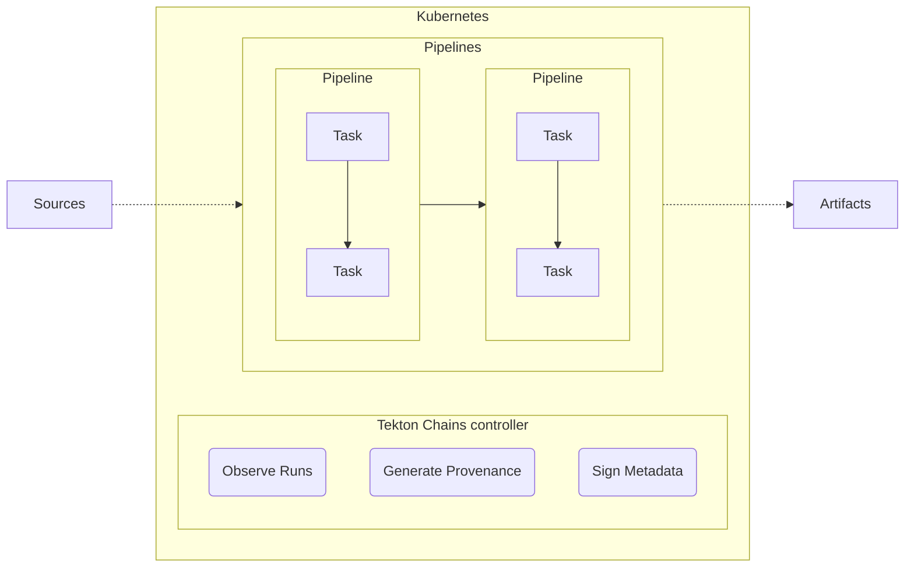

```mermaid
graph LR
  subgraph TOP[Kubernetes]
    direction TB

    subgraph C[Tekton Chains controller]
      direction TB
      c1(Observe Runs)
      c2(Generate Provenance) 
      c3(Sign Metadata)
    end

    subgraph B[Pipelines]
      direction LR
      subgraph B1[Pipeline]
        direction TB
        i1[Task] --> f1[Task]
      end

      subgraph B2[Pipeline]
        direction TB
        i2[Task] --> f2[Task]
      end
      B1 --> B2
    end
  end

  A[Sources] -.-> B -.-> D[Artifacts]
```
